# Proyecto 3: Batalla Naval sobre un microprocesador RISC-V

## Informe 

**Institución:** Instituto Tecnológico de Costa Rica  
**Escuela:** Ingeniería Electrónica  
**Curso:** EL3313 — Taller de Diseño Digital  
**Semestre:** II Semestre 2026  
**Equipo:** 06  

## Integrantes

| Nombre | Carné |
|---|---|
| Yerlin Angelitte Gamboa Ortiz | 2022184205 |
| Anthony Fabián Chacón Montero | 2022117452 |

## Profesores

- Dr.-Ing. Jeferson González-Gómez

---

## 1. Introducción

El proyecto consiste en desarrollar un sistema de Batalla Naval para dos jugadores sobre una FPGA Basys 3, integrando un procesador RISC-V de 32 bits, memorias de programa y datos, periféricos de entrada y salida y una aplicación de PC. Su propósito es aplicar los conocimientos de diseño digital mediante la construcción de una plataforma capaz de ejecutar un programa en ensamblador e interactuar con dispositivos externos.

El Jugador 1 utiliza los botones y switches de la FPGA y observa la partida mediante un monitor VGA. El Jugador 2 interactúa mediante una aplicación gráfica desarrollada en Python, comunicada con la FPGA mediante UART. Cada jugador dispone de un tablero de 8 × 8 casillas y una flota de tres barcos de tamaños 4, 3 y 2. La visualización distingue el tablero propio del estado conocido del tablero rival, manteniendo ocultas las posiciones de los barcos enemigos que todavía no han sido descubiertos.

La arquitectura integra una ROM para las instrucciones, una RAM para los datos y una interconexión que permite acceder a los periféricos mediante memoria mapeada. El programa en ensamblador coordina las operaciones de la partida, mientras que los módulos de hardware proporcionan los recursos de comunicación, lectura de controles, generación de video e indicadores visuales y sonoros.

Este informe presenta los fundamentos teóricos, la arquitectura y las decisiones de implementación del sistema. También describe el programa en ensamblador, la aplicación de PC y el protocolo de comunicación UART, y analiza las pruebas realizadas, los resultados obtenidos y las limitaciones identificadas durante el desarrollo.

## 2. Objetivos

### 2.1 Objetivo general

Diseñar e implementar un sistema de Batalla Naval para dos jugadores sobre una FPGA Basys 3, utilizando un procesador RISC-V de 32 bits y periféricos mapeados en memoria, con una interfaz local mediante VGA y controles físicos y una interfaz remota en PC mediante UART.

### 2.2 Objetivos específicos

1. Reutilizar e integrar un procesador RISC-V de diseño propio, utilizado previamente en otro curso, con las memorias y los periféricos necesarios para ejecutar el programa de Batalla Naval en ensamblador.

2. Integrar las memorias de programa y datos con los periféricos mediante una interconexión con direccionamiento de memoria mapeada.

3. Desarrollar el programa en ensamblador para gestionar la colocación de barcos, la validación de disparos, la alternancia de turnos, la detección de hundimientos y la determinación del ganador.

4. Implementar una interfaz local que incluya generación de video VGA, lectura de botones y switches, displays de siete segmentos, LED y retroalimentación sonora.

5. Desarrollar una aplicación gráfica en Python y un protocolo UART que permitan al Jugador 2 introducir sus acciones y visualizar la información recibida desde la FPGA.

6. Evaluar el funcionamiento de los bloques y del sistema integrado mediante simulaciones y pruebas físicas, documentando los resultados, los problemas encontrados y las soluciones aplicadas.

---
## 3. Fundamentación teórica

### 3.1 Procesador RISC-V y lenguaje ensamblador

RISC-V es una arquitectura de conjunto de instrucciones que define las operaciones que puede ejecutar un procesador. Su conjunto base RV32I utiliza registros de 32 bits e incluye operaciones aritméticas, lógicas, de acceso a memoria y de control del flujo del programa [1]. El lenguaje ensamblador permite expresar estas instrucciones mediante nombres como `add`, `lw`, `sw` y `beq`.

En este proyecto se reutiliza un procesador RISC-V de diseño propio, que ya se había utilizado en un curso anterior. El trabajo se centra en integrarlo con las memorias y los periféricos necesarios para ejecutar el juego de Batalla Naval.

### 3.2 Memorias y acceso a periféricos

La memoria de instrucciones almacena el programa que ejecuta el procesador, mientras que la memoria de datos conserva información que cambia durante su ejecución, como los tableros, los disparos y el turno actual.

La entrada y salida mapeada en memoria permite acceder a los periféricos mediante direcciones asignadas a sus registros. Así, el programa puede utilizar instrucciones de lectura y escritura para consultar las entradas del jugador, intercambiar datos por UART y controlar los indicadores y el contenido de la pantalla.

### 3.3 Generación de video VGA

La interfaz VGA utiliza señales de color y señales de sincronización horizontal y vertical para formar una imagen. El circuito de video recorre la pantalla de manera continua y establece el color correspondiente a cada píxel [2].

La representación mediante tiles divide la pantalla en bloques cuya apariencia se determina mediante códigos almacenados en memoria. Una memoria de doble puerto permite que el procesador actualice estos códigos y que el circuito VGA los consulte mediante un puerto independiente [3]. Esta organización resulta adecuada para representar los tableros y sus distintos estados.

### 3.4 Comunicación UART y entradas del usuario

UART permite transmitir y recibir datos de forma serial sin compartir una señal de reloj entre los dispositivos. Ambos extremos deben utilizar la misma velocidad y el mismo formato de transmisión. En Batalla Naval, esta comunicación conecta la FPGA con la aplicación de Python; el protocolo del proyecto define cómo interpretar los datos de colocación, disparos y resultados.

Los botones mecánicos pueden generar varias transiciones al presionarse, fenómeno conocido como rebote. El circuito antirrebote acepta el cambio cuando la señal permanece estable durante un intervalo. Además, la sincronización adapta las entradas al reloj del sistema y reduce el riesgo de que sus cambios afecten el funcionamiento de la lógica.

## 4. Diseño y arquitectura del sistema

### 4.1 Descripción general

El sistema implementa el juego Batalla Naval para dos jugadores. El jugador 1 interactúa mediante los controles de la FPGA y visualiza su información en un monitor VGA. El jugador 2 utiliza una aplicación de Python en la computadora, conectada con la FPGA mediante UART.

Cada jugador dispone de un tablero de 8 × 8 casillas y una flota de tres barcos de longitudes 4, 3 y 2. La partida comprende la colocación de los barcos, el intercambio de disparos por turnos y la identificación del ganador cuando se hunde toda la flota contraria.

La FPGA integra un procesador RISC-V de diseño propio, utilizado previamente en otro curso, junto con la memoria de instrucciones, la memoria de datos y los periféricos del juego. El procesador ejecuta el programa en ensamblador y accede a los periféricos mediante registros mapeados en memoria.

El sistema de video genera la imagen para el jugador 1, mientras que la aplicación de Python presenta la información del jugador 2 y permite introducir sus acciones. Como salidas adicionales, la FPGA utiliza indicadores LED, displays de siete segmentos y un buzzer para comunicar estados y eventos de la partida.

### 4.2 Diagrama de primer nivel

El diagrama de primer nivel presenta una visión general del sistema Batalla Naval implementado en la FPGA, identificando sus principales componentes y las señales que permiten la interacción con el exterior.

Como entradas, el sistema recibe un reloj de 100 MHz, utilizado para sincronizar su funcionamiento, los botones para controlar las acciones del jugador 1 y la comunicación con la computadora del jugador 2. Esta última permite intercambiar información entre la FPGA y la aplicación desarrollada en Python.

Las salidas comprenden la interfaz VGA para visualizar el juego, los displays de siete segmentos y los LED para indicar estados de la partida, y el buzzer para proporcionar retroalimentación sonora.

Dentro del sistema se representa el procesador RISC-V, encargado de ejecutar el programa del juego, junto con las memorias ROM y RAM, utilizadas para almacenar las instrucciones y los datos necesarios durante la ejecución.

   
  <em>Figura 1. Diagrama de primer nivel del sistema Batalla Naval.</em>

### 4.3 Diagrama de segundo nivel

El diagrama de segundo nivel muestra la organización interna del sistema Batalla Naval y las conexiones entre el procesador RISC-V, las memorias y los periféricos. También identifica las principales señales de control y los buses utilizados para intercambiar información entre los diferentes bloques.

El procesador RISC-V constituye la unidad central del sistema. Se conecta directamente con la memoria ROM mediante las señales de dirección e instrucción, permitiendo obtener el programa que debe ejecutar. Por otra parte, se comunica con la RAM y los periféricos a través del bloque de interconexión y mapeo de memoria, utilizando señales de dirección, datos y habilitación de escritura.

La memoria RAM almacena la información utilizada durante la ejecución del juego y recibe las señales necesarias para realizar operaciones de lectura y escritura. El bloque de interconexión determina el destino de cada acceso según la dirección proporcionada por el procesador, permitiendo compartir el espacio de direccionamiento entre la memoria de datos y los periféricos.

Los periféricos se organizan en cuatro bloques principales: Jugador 1, UART, VGA e Indicadores. El primero recibe los botones y switches de la FPGA, UART permite la transmisión y recepción de información con la computadora, VGA genera las señales de color y sincronización para el monitor, y el bloque de indicadores controla los displays de siete segmentos, LED y buzzer. Estos bloques se comunican con el procesador mediante la interconexión de memoria y sus respectivos buses de periféricos.

Finalmente, las señales de reloj y reinicio permiten sincronizar e inicializar los componentes del sistema, mientras que el módulo VGA dispone adicionalmente de un reloj de píxel para la generación de video.

   
  <em>Figura 2. Diagrama de segundo nivel de la arquitectura e interconexión del sistema Batalla Naval.</em>

### 4.4 Diagramas de tercer nivel

Los diagramas de tercer nivel presentan con mayor detalle la organización interna de los bloques funcionales del sistema Batalla Naval. Estos permiten identificar los módulos que conforman cada periférico, las señales utilizadas y las conexiones necesarias para su funcionamiento.

Para facilitar su interpretación, los diagramas se presentan de manera independiente, incluyendo las memorias ROM y RAM, la interconexión de memoria, las entradas del jugador 1, la comunicación UART, el sistema VGA y los indicadores.

#### 4.4.1 Memoria ROM

La memoria ROM almacena las instrucciones del programa de Batalla Naval que ejecuta el procesador RISC-V. Su estructura incluye un bloque de conversión que transforma la dirección de 32 bits (`prog_address_i`) en un índice de acceso (`addr_index`), utilizado para seleccionar la instrucción correspondiente.

La memoria recibe las señales de reloj (`clk_i`) y reinicio (`rst_i`), mientras que el bloque de inicialización proporciona el contenido del programa. Finalmente, la instrucción seleccionada se entrega al procesador mediante la salida `prog_instr`.

  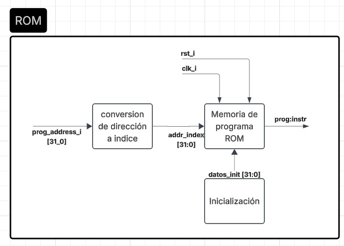 
  <em>Figura 3. Diagrama de tercer nivel de la memoria ROM.</em>

#### 4.4.2 Memoria RAM

La memoria RAM permite almacenar y consultar los datos utilizados durante la ejecución del juego. Su estructura incluye un bloque de conversión que transforma la dirección de entrada (`addr_i`) en un índice para acceder a las posiciones de memoria.

La lógica de escritura controla el almacenamiento de datos mediante las señales `wdata_i` y `write_enable_i`. Por su parte, el buffer de lectura entrega el contenido seleccionado mediante `rdata_o[31:0]`. Las señales de reloj (`clk_i`) y reinicio (`rst_i`) permiten controlar el funcionamiento del bloque.

  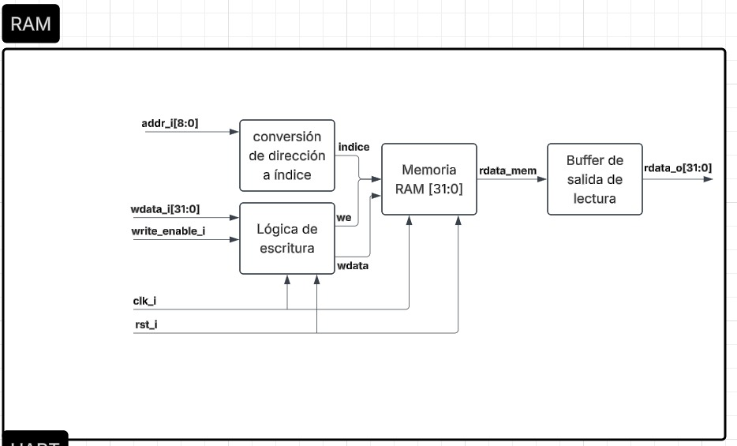 
  <em>Figura 4. Diagrama de tercer nivel de la memoria RAM.</em>

#### 4.4.3 Interconexión y mapeo de memoria

El bloque de interconexión permite comunicar el procesador RISC-V con la memoria RAM y los periféricos mediante direcciones mapeadas en memoria. Su estructura está compuesta por un decodificador de direcciones, un decodificador de escritura y un multiplexor de lectura.

El decodificador de direcciones genera las señales de selección (`sel_ram`, `sel_uart`, `sel_vga`, `sel_j1` y `sel_ind`) para identificar el dispositivo correspondiente. El decodificador de escritura controla las habilitaciones de escritura de cada bloque, mientras que el multiplexor selecciona los datos de lectura que deben regresar al procesador. Esta organización permite gestionar los accesos a memoria y periféricos desde una misma interfaz.

  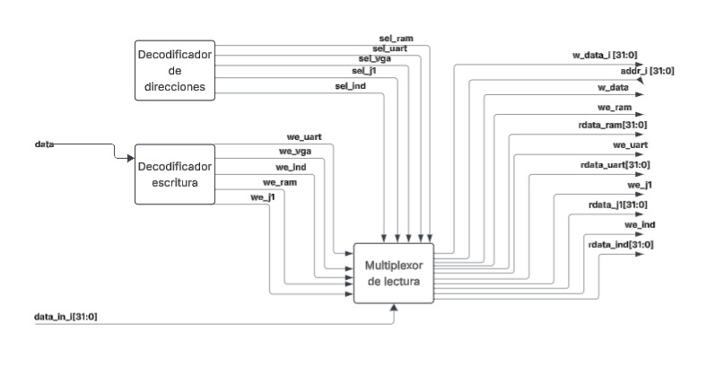 
  <em>Figura 5. Diagrama de tercer nivel de la interconexión y mapeo de memoria.</em>

#### 4.4.4 Entradas del jugador 1

El bloque de entradas del jugador 1 permite procesar las señales provenientes de los botones y switches de la FPGA. Los sincronizadores adaptan estas señales al reloj del sistema, mientras que los circuitos antirrebote (*debouncers*) eliminan las transiciones no deseadas producidas por los botones mecánicos.

Las señales procesadas se almacenan en un registro de estado de 32 bits (`status_reg`), que reúne la información de los controles. Finalmente, un multiplexor de lectura utiliza la dirección `addr_i[1:0]` para seleccionar los datos que se entregan al procesador mediante `rdata_o[31:0]`.

   
  <em>Figura 6. Diagrama de tercer nivel del bloque de entradas del jugador 1.</em>

#### 4.4.5 Comunicación UART

El bloque UART permite la comunicación bidireccional entre la FPGA y la computadora. Su estructura incluye los módulos UART RX y UART TX, encargados de recibir y transmitir datos seriales, respectivamente. Ambos utilizan un generador de baudios que proporciona la señal de temporización (`baud_tick`).

Los registros RX y TX almacenan los datos recibidos y los que serán transmitidos. La lógica de decodificación controla las operaciones de escritura, mientras que el registro de estado conserva señales como `rx_ready`, `tx_busy` y `tx_done`. Finalmente, un multiplexor de lectura permite al procesador consultar los datos recibidos y el estado de la comunicación mediante `rdata_o[31:0]`.

  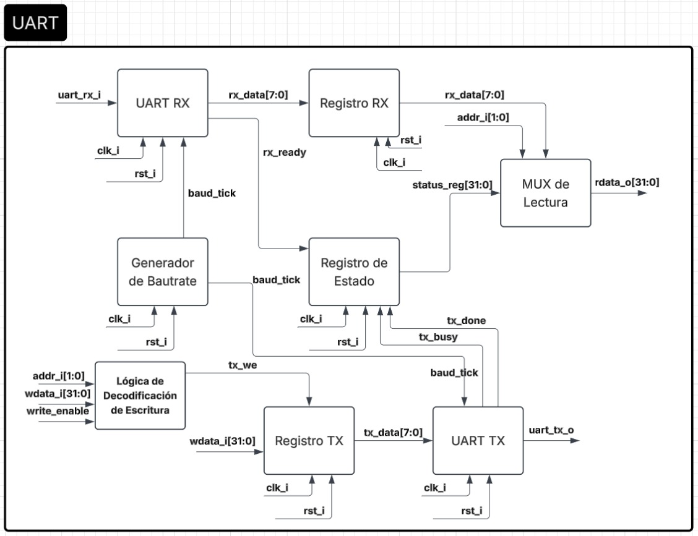 
  <em>Figura 7. Diagrama de tercer nivel del módulo de comunicación UART.</em>

#### 4.4.6 Sistema VGA

El sistema VGA se encarga de generar la imagen del juego en el monitor. Su arquitectura incluye un bloque de memoria mapeada que permite al procesador acceder a la memoria de video para actualizar la información visual. El generador de temporización utiliza el reloj de píxel (`clk_pixel_i`) para producir las coordenadas de pantalla (`pixel_x`, `pixel_y`) y las señales de sincronización horizontal y vertical.

El bloque de cálculo de posición determina las coordenadas del tile y la dirección de memoria correspondiente. El generador de píxel utiliza esta información y los datos almacenados en la memoria de video para determinar qué píxeles deben activarse. Finalmente, el generador RGB convierte esta información en las señales de color `vga_red_o`, `vga_green_o` y `vga_blue_o`, necesarias para representar la imagen.

  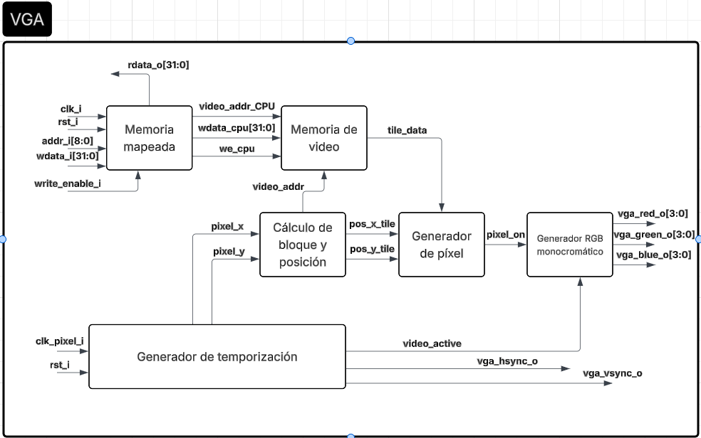 
  <em>Figura 8. Diagrama de tercer nivel del sistema VGA.</em>

#### 4.4.7 Indicadores

El bloque de indicadores permite comunicar visual y auditivamente los estados del juego mediante los displays de siete segmentos, LED y buzzer. Su estructura incluye un decodificador de dirección y escritura que genera las señales de habilitación para los registros de cada dispositivo.

El registro del display almacena la información que posteriormente se separa en dígitos, se convierte a siete segmentos y se multiplexa para su visualización. El registro LED controla los indicadores luminosos, mientras que el registro del buzzer proporciona la información al selector de sonido y al generador de frecuencia. Finalmente, un multiplexor de lectura permite al procesador consultar el contenido de los registros mediante `rdata_o[31:0]`.

  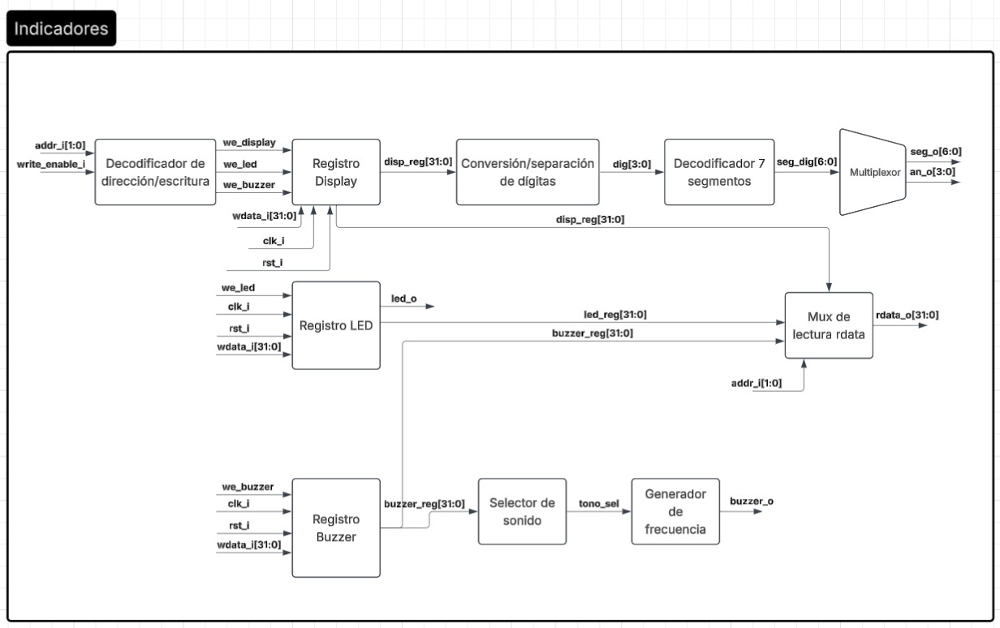 
  <em>Figura 9. Diagrama de tercer nivel del bloque de indicadores.</em>

## 5. Implementación en hardware

### 5.1 Integración general en Vivado

La implementación del sistema Batalla Naval se realizó en Vivado mediante módulos desarrollados en SystemVerilog, integrando el procesador RISC-V, las memorias y los periféricos necesarios para el funcionamiento del juego sobre la FPGA Basys 3.

El módulo principal `battleship_top.sv` establece las conexiones físicas con los dispositivos externos, incluyendo el reloj de 100 MHz, los botones y switches, la comunicación UART, la salida VGA y los indicadores. A su vez, el módulo `battleship_system.sv` integra el procesador con las memorias ROM y RAM, la interconexión de memoria y los periféricos mapeados.

La organización modular permite que el procesador ejecute el programa almacenado en la ROM y controle los diferentes dispositivos mediante operaciones de lectura y escritura. Los módulos auxiliares se encargan del procesamiento de entradas, la comunicación serial, la generación de video y la señalización visual y sonora.

Esta estructura facilita la integración de los componentes y su verificación mediante simulaciones y pruebas físicas.

### 5.2 Procesador RISC-V y memorias

El procesador utilizado corresponde a un diseño propio basado en la arquitectura RV32I de 32 bits, desarrollado y utilizado anteriormente en otro curso. Para este proyecto se integró mediante el archivo `riscv_core_battleship.sv`. Su estructura utiliza cinco etapas de procesamiento: búsqueda de instrucciones (IF), decodificación (ID), ejecución (EX), acceso a memoria (MEM) y escritura de resultados (WB). Integra una unidad aritmético-lógica, un banco de registros, lógica de control y mecanismos de *forwarding* y detección de riesgos (*hazards*) para gestionar dependencias entre instrucciones.

La memoria de programa se implementó mediante `program_rom.sv`, con capacidad de 2048 palabras de 32 bits (8 KiB). Su contenido se inicializa mediante un archivo `.mem`, configurado en el módulo principal como `placement_both_players.mem`. La lectura es combinacional y permite entregar las instrucciones solicitadas por el procesador.

Por otra parte, `data_ram.sv` implementa una memoria de 1024 palabras de 32 bits (4 KiB), utilizada para almacenar la información de la partida. Presenta escritura síncrona y lectura combinacional. Ambas memorias se conectan al procesador mediante buses independientes para instrucciones y datos, mientras que el acceso a la RAM se realiza a través del bloque de interconexión.

### 5.3 Interconexión y periféricos mapeados en memoria

La comunicación entre el procesador RISC-V, la memoria RAM y los periféricos se implementó mediante el módulo `interconnect.sv`. Este bloque utiliza las direcciones generadas por el procesador para seleccionar el dispositivo correspondiente y controlar las operaciones de lectura y escritura.

La interconexión recibe las señales de dirección (`data_address_i`), datos (`data_out_i`) y habilitación de escritura (`data_we_i`). A partir de estas, genera las señales de control de cada periférico y selecciona los datos que regresan al procesador mediante `data_in_o`.

La Tabla 1 presenta las direcciones utilizadas en la implementación.

**Tabla 1. Mapa de direcciones de memoria y periféricos.**

| Dispositivo | Dirección o rango | Función |
|---|---|---|
| RAM | `0x00002000–0x00002FFF` | Almacenamiento de datos |
| UART Control | `0x00010040` | Control y estado |
| UART TX | `0x00010044` | Transmisión de datos |
| UART RX | `0x00010048` | Recepción de datos |
| Entradas Jugador 1 | `0x00010120` | Lectura de controles |
| Display | `0x00010130` | Control de siete segmentos |
| LED | `0x00010138` | Indicadores luminosos |
| Buzzer | `0x00010140` | Control de sonido |
| VGA | `0x00011000–0x000117FF` | Memoria de video |

La memoria ROM utiliza un bus independiente para entregar instrucciones al procesador, mientras que la RAM y los periféricos comparten la interconexión de datos. Esta organización permite controlar los dispositivos mediante instrucciones de acceso a memoria, sin requerir instrucciones especiales de entrada y salida.

### 5.4 Implementación del sistema VGA

El sistema de video se integró mediante `battleship_vga_core.sv`, encargado de coordinar los módulos necesarios para generar la imagen del juego. El módulo `battleship_clock_gen.sv` utiliza un Clock Wizard para obtener el reloj de píxel de 25 MHz a partir del reloj de entrada de 100 MHz. Por su parte, `battleship_vga_timing.sv` genera las señales de sincronización horizontal y vertical para una resolución de 640 × 480 píxeles a aproximadamente 60 Hz.

La memoria de video se implementó mediante `battleship_vga_ram.sv`, con 512 posiciones de 32 bits y dos puertos independientes. El primero permite al procesador actualizar su contenido, mientras que el segundo proporciona los datos al circuito VGA. La pantalla se organiza en una cuadrícula de 20 × 15 tiles de 32 × 32 píxeles, utilizando los tres bits menos significativos de cada palabra para representar el estado visual de la casilla.

**Tabla 2. Codificación de los estados de la memoria VGA.**

| Código | Representación |
|---|---|
| `000` | Agua |
| `001` | Barco |
| `010` | Fallo |
| `011` | Impacto |
| `100` | Cursor sobre agua |
| `101` | Cursor sobre barco |

El módulo `battleship_vga_tile_mapper.sv` convierte las coordenadas de los píxeles en direcciones de memoria, mientras que `battleship_vga_renderer.sv` genera los colores, las cuadrículas y las marcas de disparos. Adicionalmente, `battleship_vga_text_overlay.sv` incorpora los mensajes y la información de la partida, y `battleship_vga_ui_monitor.sv` proporciona los estados necesarios para actualizar esta interfaz.

El cursor se maneja mediante una superposición parpadeante, evitando que su posición modifique permanentemente el contenido de los tableros. Asimismo, las señales de control se sincronizan entre los dominios de reloj del procesador y del sistema VGA.

### 5.5 Comunicación UART y entradas del jugador 1

La comunicación entre la FPGA y la computadora se implementó mediante `uart_peripheral.sv`, configurado a 115200 baudios con transmisión de 8 bits de datos, sin paridad y un bit de parada (8N1). El módulo integra la lógica de transmisión y recepción serial, sincronización de la entrada y registros de control y datos.

El registro de control utiliza el bit 0 (`tx_busy`) para indicar una transmisión activa y el bit 1 (`new_rx`) para señalar la recepción de un dato. Los registros TX y RX permiten intercambiar bytes con el procesador mediante la interconexión de memoria.

Por otra parte, las entradas del jugador 1 se implementaron mediante `j1_inputs_mmio.sv` y `debounce_j1.sv`. Cada entrada utiliza un sincronizador de dos flip-flops y un filtro antirrebote de 500 000 ciclos de reloj. Los estados procesados se agrupan en un registro de 32 bits que puede consultar el procesador.

**Tabla 3. Asignación de bits del registro de entradas del jugador 1.**

| Bit | Control | Función |
|---|---|---|
| 0 | BTN UP | Mover arriba |
| 1 | BTN DOWN | Mover abajo |
| 2 | BTN LEFT | Mover izquierda |
| 3 | BTN RIGHT | Mover derecha |
| 4 | SW1 | Rotar barco |
| 5 | SW0 | Confirmar o disparar |
| 6 | Reservado | Sin conexión activa en el sistema final |

El botón central se utiliza para reiniciar la partida, mientras que SW15 permite realizar un reinicio general del sistema. La diferencia es que el botón central conserva los contadores de victorias, mientras que SW15 también los reinicia. Estas señales se gestionan mediante `battleship_reset_uart_controller.sv`, que coordina los reinicios y determinadas notificaciones UART.

### 5.6 Indicadores visuales y sonoros

Los indicadores del sistema se implementaron mediante `indicators_mmio.sv`, que proporciona registros de 32 bits para el control de los displays, LED y buzzer. Estos registros pueden consultarse y modificarse desde el procesador mediante las direcciones de memoria asignadas.

Los displays de siete segmentos utilizan `battleship_victory_counter.sv` y `battleship_sevenseg_driver.sv`. El primero registra las victorias acumuladas de ambos jugadores, con un límite de 99 por jugador, conservando los valores al reiniciar una partida. El segundo convierte los contadores en decenas y unidades y multiplexa los cuatro dígitos del display. Los 16 LED de la FPGA se controlan mediante los bits inferiores del registro correspondiente.

La retroalimentación sonora se implementó mediante `battleship_buzzer_event_controller.sv` y `battleship_buzzer_driver.sv`. El controlador identifica eventos del juego a partir de las operaciones UART y RAM, generando códigos de sonido de 3 bits. El driver convierte estos códigos en secuencias temporizadas para distinguir eventos como inicio de batalla, colocación de barcos, impacto, fallo, hundimiento, colocación inválida y victoria.

## 6. Programa en ensamblador RISC-V

### 6.1 Organización general del programa

El programa de Batalla Naval se desarrolla en lenguaje ensamblador RISC-V y se almacena en la memoria ROM para su ejecución por el procesador. Su funcionamiento se basa en instrucciones de acceso a memoria, operaciones aritméticas, comparaciones y saltos condicionales que permiten controlar las acciones de los jugadores.

Durante la inicialización, el programa establece las direcciones base de los periféricos y las regiones de memoria RAM destinadas a los tableros y variables del juego. Cada tablero de 8 × 8 casillas se representa mediante 64 palabras de 32 bits, permitiendo consultar y modificar individualmente su contenido.

La organización del programa utiliza ciclos de ejecución y subrutinas para procesar los controles físicos del jugador 1 y los mensajes UART del jugador 2. Durante la colocación, se validan los límites y traslapes de los barcos de tamaños 4, 3 y 2, almacenando sus posiciones en RAM y actualizando las interfaces correspondientes.

El intercambio de información con los periféricos se realiza mediante instrucciones `lw` y `sw`, mientras que las subrutinas permiten reutilizar las operaciones de recepción, transmisión, validación y actualización del estado del juego.

### 6.2 Organización de los tableros y variables en RAM

La memoria RAM almacena los tableros de ambos jugadores y los resultados de los disparos. Cada tablero contiene 64 casillas organizadas en una matriz de 8 × 8, donde cada posición ocupa una palabra de 32 bits.

**Tabla 4. Distribución de los datos del juego en memoria RAM.**

| Dirección base | Contenido |
|---|---|
| `0x00002000` | Posiciones de los barcos del jugador 1 |
| `0x00002100` | Posiciones de los barcos del jugador 2 |
| `0x00002200` | Disparos realizados por el jugador 1 |
| `0x00002300` | Disparos realizados por el jugador 2 |

La dirección de cada casilla se calcula a partir de su fila y columna:

  <strong>Dirección = Base + 4 × (8 × fila + columna)</strong>

Los tableros de barcos utilizan el valor cero para representar agua y los valores 4, 3 y 2 para identificar las casillas ocupadas por cada barco. Por su parte, los mapas de disparos utilizan cero para una casilla sin disparar, 2 para un fallo y 3 para un impacto.

Durante la inicialización, el programa limpia las cuatro regiones de memoria. Posteriormente, utiliza instrucciones `lw` y `sw` para consultar las posiciones, validar disparos repetidos y actualizar los resultados de la partida.

### 6.3 Fases y control de la partida

El programa organiza el funcionamiento del juego en tres etapas principales: colocación de barcos, batalla y finalización. Durante la inicialización se limpian los tableros en RAM y se preparan los registros y periféricos necesarios.

En la fase de colocación, el procesador atiende las entradas físicas del jugador 1 y los mensajes UART del jugador 2. Para ambos jugadores se validan la orientación, los límites del tablero y los posibles traslapes. Una vez colocados los tres barcos de cada jugador, se notifica el inicio de la batalla mediante UART y se actualiza el indicador de estado.

Durante la batalla, los jugadores realizan disparos por turnos. El programa verifica si la casilla seleccionada ya fue utilizada y determina si corresponde a un impacto o fallo. Los resultados se almacenan en RAM y se comunican mediante VGA o UART, según corresponda al jugador.

La condición de victoria se comprueba contabilizando los impactos acumulados sobre la flota contraria, formada por nueve casillas en total. Cuando se alcanza esta cantidad, el programa comunica el resultado y termina la partida.

   
  <em>Figura 10. Diagrama de flujo general del juego Batalla Naval.</em>

### 6.4 Validación de colocaciones y disparos

La validación de los barcos se realiza mediante rutinas en ensamblador que comprueban los límites del tablero y posibles traslapes. Para el jugador 1, el programa restringe el movimiento del cursor según la orientación y longitud del barco, impidiendo que se coloque fuera del tablero. Antes de confirmar, revisa las casillas correspondientes en RAM para verificar que estén disponibles.

Para el jugador 2, el procesador interpreta las coordenadas y la orientación recibidas por UART. Si la colocación es válida, almacena el barco y transmite el código de aceptación (`0x01`). En caso contrario, responde con un código de traslape (`0x02`) o fuera del tablero (`0x04`), evitando modificar las posiciones previamente almacenadas.

Durante la fase de batalla, cada disparo se comprueba mediante el mapa de disparos correspondiente. Si la casilla ya fue seleccionada, el programa ignora el disparo repetido. De lo contrario, consulta el tablero del oponente para determinar si existe un barco, registra el resultado como impacto o fallo y actualiza la información de la partida.

### 6.5 Comunicación con los periféricos desde ensamblador

El programa en ensamblador utiliza las instrucciones `lw` y `sw` para comunicarse con los periféricos mediante direcciones mapeadas en memoria. Estas operaciones permiten consultar las entradas de los jugadores, transmitir información y actualizar los dispositivos de salida sin utilizar instrucciones especiales de entrada y salida.

Para el jugador 1, el procesador consulta el registro de estado ubicado en `0x00010120`, identificando los controles activados. En la comunicación UART, utiliza los registros de control (`0x00010040`), transmisión (`0x00010044`) y recepción (`0x00010048`) para intercambiar información con la aplicación Python.

La visualización se actualiza mediante escrituras en la memoria VGA, ubicada entre `0x00011000` y `0x000117FF`. Asimismo, el procesador puede acceder a los registros de los displays, LED y buzzer para controlar los indicadores del sistema.

La interconexión de memoria decodifica cada dirección y dirige las operaciones hacia el periférico correspondiente, permitiendo que el programa coordine los diferentes componentes del juego.

## 7. Aplicación Python y protocolo UART

### 7.1 Implementación de la aplicación Python

La aplicación del jugador 2 se desarrolló en Python utilizando Tkinter para la interfaz gráfica y PySerial para la comunicación con la FPGA. El archivo principal `main.py` coordina las diferentes etapas de la partida y establece la conexión serial mediante el puerto COM seleccionado, a una velocidad de 115200 baudios con formato 8N1.

La interfaz se implementó mediante `interfaz.py`, mostrando dos tableros de 8 × 8 casillas: el tablero propio, donde se visualizan los barcos y disparos recibidos, y el tablero rival, donde únicamente se muestran los resultados de los disparos realizados. También presenta mensajes de colocación, cambios de turno y resultados de la partida.

Los módulos `barcos.py`, `disparos.py` y `tablero.py` gestionan las posiciones y la representación local de las casillas. Por su parte, `recepcion_colocacion.py` y `recepcion_disparos.py` interpretan las respuestas de la FPGA para actualizar la interfaz.

### 7.2 Protocolo de comunicación UART

El intercambio de información se realiza mediante un protocolo de bytes de 8 bits definido en `protocolo.py`. Este establece la codificación de las coordenadas, la orientación de los barcos y los resultados transmitidos entre la computadora y la FPGA.

**Tabla 5. Formato de los mensajes del protocolo UART.**

| Dirección | Mensaje | Formato | Descripción |
|---|---|---|---|
| PC → FPGA | Identificador de barco | `000100II` | `II`: 00 = barco 4, 01 = barco 3, 10 = barco 2 |
| PC → FPGA | Posición del barco | `0OFFFCCC` | `O`: orientación, `FFF`: fila, `CCC`: columna |
| PC → FPGA | Disparo | `10FFFCCC` | Coordenadas del disparo |
| FPGA → PC | Respuesta de colocación | `0x01`, `0x02`, `0x04` | Aceptado, traslape o fuera del tablero |
| FPGA → PC | Resultado del disparo J2 | Bits `[3:0]` | Bit 0 = 0, bit 1 = acierto, bit 2 = repetido, bit 3 = hundido |
| FPGA → PC | Disparo del jugador 1 | Bits `[7:0]` | Bit 0 = 1, bits 1–3 = columna, bits 4–6 = fila, bit 7 = acierto |

En los mensajes de colocación, la orientación se representa mediante 0 para horizontal y 1 para vertical. La computadora transmite dos bytes por cada barco y un byte por disparo.

Adicionalmente, la aplicación reconoce los siguientes códigos de eventos:

- `0x31`: el jugador 1 terminó de colocar su flota.
- `0x20`: inicio de la fase de batalla.
- `0x30`: reinicio de la partida.
- `0x7C`: victoria del jugador 1.
- `0x7E`: victoria del jugador 2.

### 7.3 Procesamiento de respuestas y actualización de la interfaz

La aplicación utiliza `UART.py` para transmitir y recibir datos, manteniendo una cola de recepción y detectando eventos especiales como el reinicio de la partida. El módulo `protocolo.py` codifica las acciones del jugador y decodifica las respuestas recibidas.

Durante la colocación, la aplicación espera la confirmación de la FPGA antes de registrar un barco. En la fase de batalla, procesa los resultados de los disparos y actualiza los tableros con impactos o fallos. Los mensajes recibidos también permiten identificar los cambios de fase y el resultado final.

La lógica principal de validación y control de la partida se ejecuta en el procesador RISC-V, mientras que la aplicación Python se encarga de la interacción del jugador 2 y de representar visualmente la información recibida.

## 8. Estrategia de verificación y simulaciones

### 8.1 Metodología de verificación

La verificación del sistema se organizó mediante simulaciones funcionales en Vivado y pruebas sobre la FPGA Basys 3. Se utilizaron testbench para comprobar el comportamiento de los módulos individuales y su integración con el procesador RISC-V.

Los testbench seleccionados incorporan comprobaciones automáticas que comparan las salidas obtenidas con los valores esperados, registrando resultados de aprobación (`PASS`) o error (`ERROR`). Este procedimiento permite detectar problemas de direccionamiento, comunicación y procesamiento de datos sin depender únicamente de la inspección visual de las señales.

### 8.2 Bancos de prueba principales

Para documentar la verificación se seleccionaron los testbench más representativos, evitando incluir pruebas experimentales o redundantes.

**Tabla 6. Principales pruebas de verificación del sistema.**

| Testbench | Verificación realizada |
|---|---|
| `tb_riscv_memory.sv` | Ejecución de instrucciones, lectura y escritura en RAM y dependencias entre instrucciones. |
| `tb_interconnect.sv` | Selección de RAM y periféricos mediante direcciones mapeadas en memoria. |
| `tb_riscv_uart_mmio.sv` | Transmisión, recepción y acceso UART desde el procesador. |
| `tb_battleship_vga_timing.sv` | Temporización VGA, sincronismos y área visible de la pantalla. |
| `tb_battleship_vga_core.sv` | Generación de colores y representación de tiles en VGA. |
| `tb_j1_inputs.sv` | Lectura de botones, combinación de entradas y procesamiento antirrebote. |
| `tb_battleship_sevenseg_driver.sv` | Conversión y multiplexado de los cuatro dígitos del display. |
| `tb_battleship_system.sv` | Integración del procesador con entradas, LED y memoria VGA. |

La prueba de integración `tb_battleship_system.sv` utiliza un programa corto para comprobar que el procesador puede leer las entradas del jugador y escribir información en los LED y la memoria de video. Por tanto, verifica la comunicación entre estos componentes, pero no representa una simulación de la partida completa.

## 9. Resultados de simulación y pruebas físicas

En esta sección se presentan los resultados obtenidos durante la verificación del sistema Batalla Naval, incluyendo las simulaciones funcionales realizadas en Vivado y las pruebas físicas de la FPGA y la aplicación Python.

Estos resultados permiten evaluar el funcionamiento de los principales componentes, identificar las limitaciones de la implementación y comprobar el cumplimiento de los objetivos del proyecto.

### 9.1 Resultados de simulaciones funcionales

Se ejecutaron ocho bancos de prueba en Vivado para verificar el funcionamiento de los principales componentes del sistema Batalla Naval. Las simulaciones incorporaron comprobaciones automáticas que permitieron comparar los resultados obtenidos con los valores esperados.

**Tabla 7. Resumen de las simulaciones funcionales realizadas.**

| Testbench | Componente verificado | Resultado |
|---|---|---|
| `tb_riscv_memory.sv` | Procesador RISC-V y memorias | PASS |
| `tb_riscv_uart_mmio.sv` | Integración RISC-V y UART | PASS |
| `tb_battleship_vga_timing.sv` | Temporización VGA | PASS |
| `tb_battleship_vga_core.sv` | Generación de imagen VGA | PASS |
| `tb_battleship_system.sv` | Integración general | PASS |
| `tb_j1_inputs.sv` | Entradas del jugador 1 | PASS |
| `tb_interconnect.sv` | Interconexión y direccionamiento | PASS |
| `tb_battleship_sevenseg_driver.sv` | Displays de siete segmentos | PASS |

#### Procesador RISC-V y memorias

La simulación `tb_riscv_memory.sv` comprobó la ejecución de instrucciones de lectura y escritura en RAM. Se verificó el almacenamiento del valor 42, su recuperación mediante `lw` y el resultado 43 de una instrucción dependiente. Todas las comprobaciones finalizaron correctamente.

  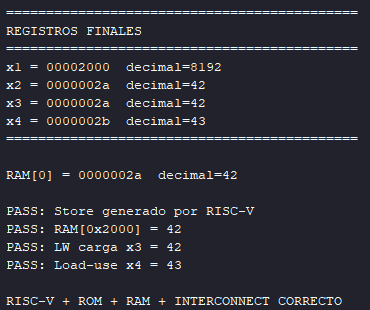 
  <em>Figura 11. Resultados de la simulación del procesador RISC-V y las memorias.</em>

#### Comunicación RISC-V y UART

El testbench `tb_riscv_uart_mmio.sv` verificó la transmisión del byte `0x41`, la recepción de `0x5A` y la lectura de datos UART mediante memoria mapeada. El procesador también utilizó correctamente el dato recibido, obteniendo el valor `0x5B`.

  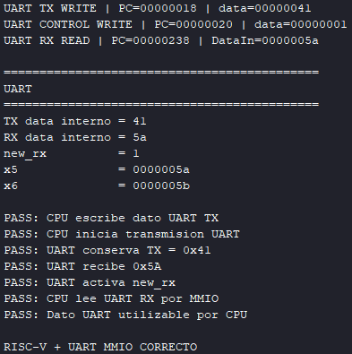 
  <em>Figura 12. Resultados de la comunicación UART mediante el procesador RISC-V.</em>

#### Temporización VGA

La simulación `tb_battleship_vga_timing.sv` comprobó el área visible, las señales de sincronización horizontal y vertical y la detección del final de un frame. Todas las verificaciones finalizaron con resultado satisfactorio.

  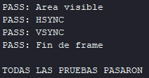 
  <em>Figura 13. Resultados de la verificación de temporización VGA.</em>

#### Generación de imagen VGA

El testbench `tb_battleship_vga_core.sv` verificó la representación de barcos en gris, fallos en rojo e impactos en verde, además de las señales HSYNC y VSYNC. Se actualizó el banco de prueba para adaptarlo a la implementación final del sistema VGA, obteniendo posteriormente todas las comprobaciones correctas.

  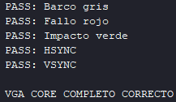 
  <em>Figura 14. Resultados de la simulación del núcleo VGA.</em>

#### Integración general del sistema

La simulación `tb_battleship_system.sv` permitió comprobar la interacción entre el procesador y los periféricos. Se verificó la lectura del valor `0x28` desde las entradas del jugador, su escritura en los LED y la actualización de una posición de memoria VGA con el valor `0x02`.

  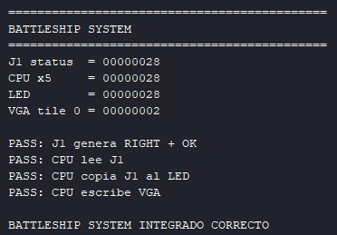 
  <em>Figura 15. Resultados de la simulación de integración del sistema.</em>

#### Entradas del jugador 1

El testbench `tb_j1_inputs.sv` comprobó el reinicio del periférico, la lectura del botón RIGHT, la activación simultánea de RIGHT y OK, la liberación de botones y la señal de reinicio. Todas las verificaciones finalizaron correctamente.

  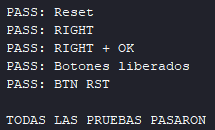 
  <em>Figura 16. Resultados de la verificación de entradas del jugador 1.</em>

#### Interconexión y mapeo de memoria

La simulación `tb_interconnect.sv` verificó la selección de la RAM y los periféricos UART, VGA, entradas, displays, LED y buzzer. También comprobó el tratamiento de direcciones inválidas y la deshabilitación de escrituras no permitidas. Todas las comprobaciones finalizaron correctamente.

  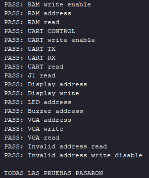 
  <em>Figura 17. Resultados de la verificación de interconexión y direccionamiento.</em>

#### Displays de siete segmentos

El testbench `tb_battleship_sevenseg_driver.sv` comprobó la representación de los contadores de victorias de ambos jugadores. Se verificó la visualización de 12 victorias para el jugador 1 y 03 para el jugador 2, incluyendo la correcta separación de decenas y unidades.

  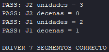 
  <em>Figura 18. Resultados de la simulación del controlador de siete segmentos.</em>

Las ocho simulaciones funcionales seleccionadas finalizaron correctamente, proporcionando evidencia del funcionamiento de los principales bloques del sistema. Estas pruebas corresponden al nivel funcional y no sustituyen la simulación temporizada post-implementación.

### 9.2 Resultados de pruebas físicas

Las pruebas físicas permitieron comprobar el funcionamiento del sistema Batalla Naval sobre la FPGA Basys 3 y su interacción con la interfaz visual generada por VGA y la aplicación Python. A continuación se presentan las principales evidencias obtenidas durante la ejecución del sistema.

#### Colocación de barcos en la interfaz VGA

La Figura 19 muestra la pantalla de colocación de barcos generada por el sistema VGA. Se presentan dos tableros de 8 × 8 casillas: el tablero propio del jugador 1 ("TU TABLERO") y el tablero del oponente ("TABLERO RIVAL").

En el tablero propio se observan los barcos colocados, representados mediante casillas de diferente color. Por su parte, el tablero rival permanece vacío, manteniendo ocultas las posiciones de los barcos del jugador 2. Adicionalmente, la interfaz presenta un mensaje que identifica la fase actual de la partida.

  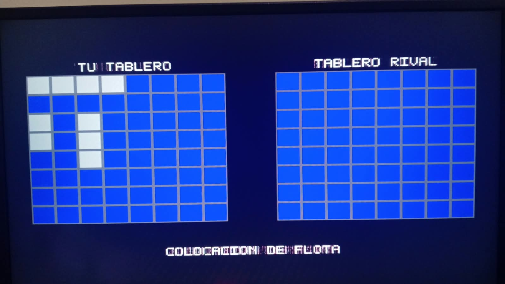 
  <em>Figura 19. Pantalla de colocación de barcos del jugador 1 mediante VGA.</em>

#### Interfaz gráfica del jugador 2

La Figura 20 muestra la interfaz gráfica desarrollada en Python para el jugador 2 durante la partida. En la parte superior se presenta un mensaje de estado que indica el turno activo, junto con una instrucción asociada a la fase de juego.

La interfaz incluye dos tableros de 8 × 8 casillas: el tablero propio ("TU TABLERO"), donde se visualizan las posiciones de los barcos colocados por el jugador 2, y el tablero rival ("TABLERO RIVAL"), utilizado para registrar los disparos realizados contra el oponente. Esta organización permite diferenciar claramente la información propia de la información conocida del adversario.

La representación gráfica facilita la interacción del jugador 2 con el sistema, mostrando de manera clara el estado de la partida y las acciones que deben realizarse en cada turno.

  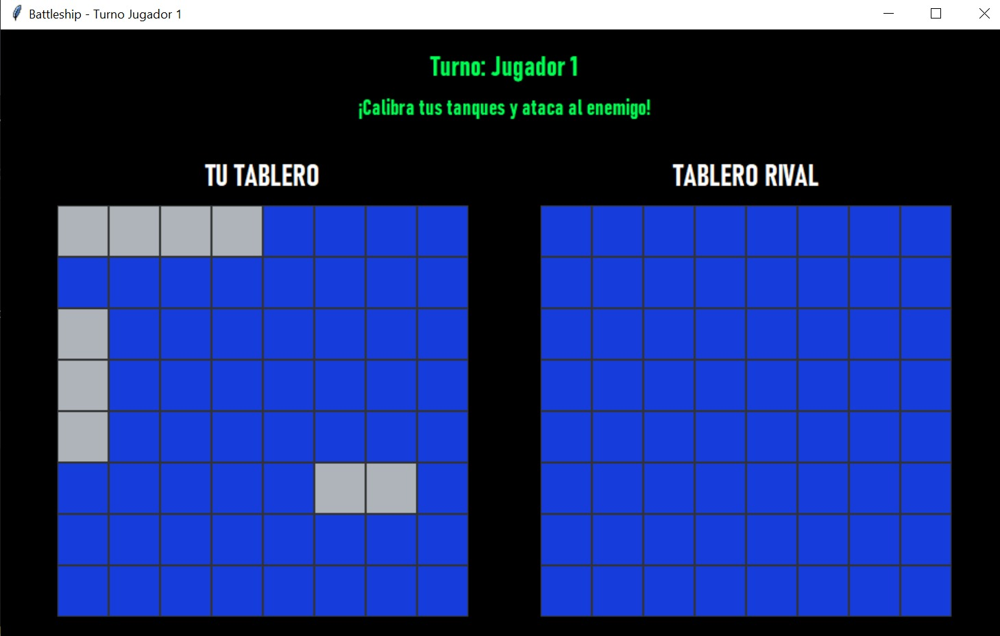 
  <em>Figura 20. Interfaz gráfica en Python correspondiente al jugador 2.</em>

#### Fase de batalla e intercambio de disparos

La Figura 21 muestra la interfaz de Python durante la fase de batalla, donde se visualizan los disparos registrados en ambos tableros. Los resultados se representan mediante símbolos de distintos colores, permitiendo identificar las casillas que han recibido disparos y diferenciarlas de aquellas que permanecen sin explorar.

Adicionalmente, la interfaz muestra el jugador que tiene el turno activo y mensajes relacionados con el resultado de los disparos. Esto permite mantener actualizado el estado visual de la partida a partir de la información intercambiada con la FPGA mediante UART.

  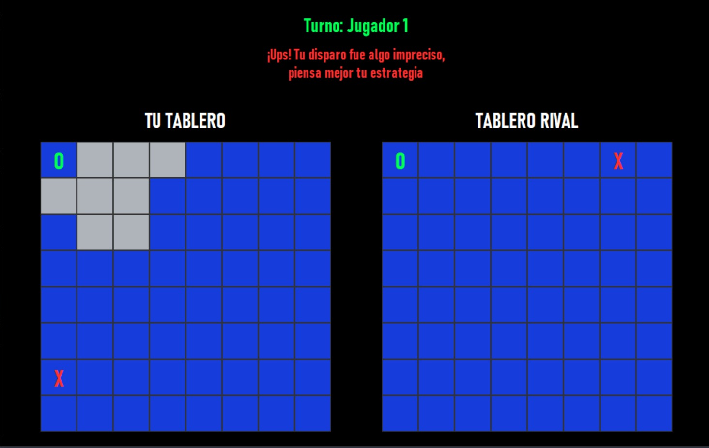 
  <em>Figura 21. Visualización de los disparos y sus resultados durante la fase de batalla.</em>

#### Finalización de la partida

La Figura 22 muestra la pantalla correspondiente al final de la partida en la interfaz VGA. En esta etapa se mantienen visibles ambos tableros con el estado final de las casillas, incluyendo los disparos registrados y las posiciones descubiertas durante el juego.

Además, la interfaz presenta un mensaje de cierre de la partida ("FIN DEL JUEGO") junto con la notificación del resultado ("VICTORIA"), indicando que el sistema logró detectar correctamente la condición de finalización y comunicar el desenlace al jugador.

Esta evidencia confirma que el sistema no solo permite la colocación y el intercambio de disparos, sino también la identificación del ganador y la presentación del resultado final mediante la salida VGA.

  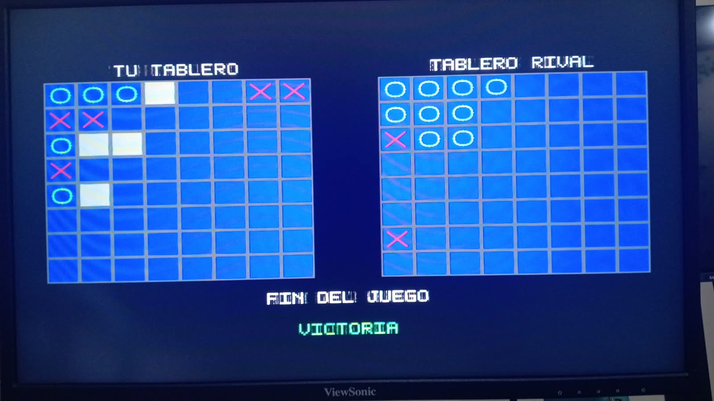 
  <em>Figura 22. Pantalla de finalización de la partida con el mensaje de victoria.</em>

#### Indicadores físicos de la FPGA

La Figura 23 muestra el funcionamiento de los indicadores físicos de la tarjeta Basys 3. Los cuatro displays de siete segmentos permiten visualizar los contadores de victorias acumuladas de ambos jugadores, utilizando dos dígitos para cada uno.

Además, se observan los LED de la FPGA utilizados para indicar estados del sistema y la conexión del buzzer externo, destinado a proporcionar retroalimentación sonora durante los diferentes eventos de la partida.

  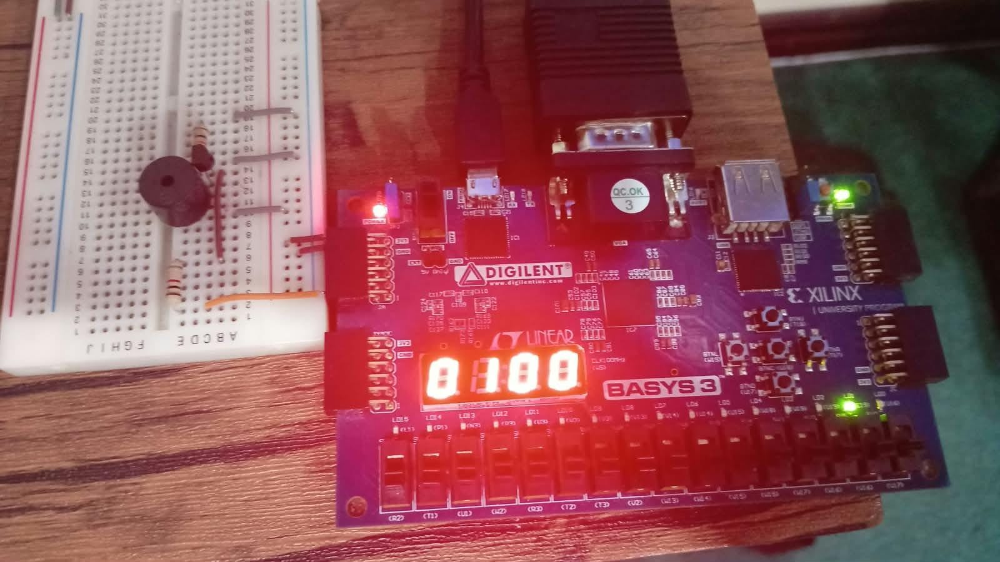 
  <em>Figura 23. Implementación física de los displays, indicadores LED y buzzer en la FPGA Basys 3.</em>

En conjunto, las pruebas físicas confirman el funcionamiento de las principales etapas del sistema: colocación de barcos, interacción del jugador 2 mediante la aplicación Python, fase de batalla, finalización de la partida y operación de los indicadores físicos de la FPGA.

## 10. Análisis e interpretación de resultados

### 10.1 Análisis de las simulaciones funcionales

Los ocho testbench ejecutados finalizaron correctamente, permitiendo verificar el funcionamiento de los principales componentes del sistema. Las pruebas del procesador RISC-V demostraron la ejecución de instrucciones de lectura y escritura, así como el manejo de dependencias entre instrucciones, mientras que las pruebas de interconexión confirmaron la selección correcta de las memorias y los periféricos mediante sus direcciones asignadas.

En el sistema UART se verificó el intercambio de datos mediante registros mapeados en memoria, comprobando que el procesador puede transmitir, recibir y procesar información. Por otra parte, las simulaciones VGA confirmaron el funcionamiento de las señales de sincronización y la representación de los diferentes estados visuales del tablero.

La prueba de integración permitió comprobar la interacción entre el procesador, las entradas físicas, los LED y la memoria de video. Estos resultados respaldan el funcionamiento individual y conjunto de los bloques evaluados, aunque no representan una simulación completa de todas las etapas de la partida.

### 10.2 Análisis de las pruebas físicas

Las pruebas físicas permitieron observar el funcionamiento del sistema sobre la FPGA Basys 3. La interfaz VGA presentó los tableros del jugador 1 y los mensajes correspondientes a las distintas etapas del juego, mientras que la aplicación Python permitió visualizar los tableros del jugador 2 y los resultados de los disparos.

Las capturas de la fase de batalla muestran la actualización de impactos y fallos, lo que evidencia la representación de los eventos intercambiados mediante UART. Asimismo, la pantalla de victoria demuestra que el sistema puede presentar el resultado final de una partida.

Los displays de siete segmentos y los LED complementaron la información visual del sistema. Estas observaciones permiten relacionar los resultados de las simulaciones con el comportamiento obtenido durante las pruebas físicas.

### 10.3 Limitaciones de la verificación

Durante la verificación fue necesario actualizar el testbench del núcleo VGA para adaptarlo a la representación gráfica utilizada en la implementación final. Después de corregir las condiciones de prueba, las comprobaciones de colores y sincronización finalizaron correctamente.

En general, los resultados obtenidos proporcionan evidencia del funcionamiento de los principales componentes y de las etapas visibles de Batalla Naval. Sin embargo, una validación más completa requeriría pruebas adicionales de temporización, comunicación y condiciones límite durante partidas completas.

## 11. Problemas encontrados y mejoras propuestas

### 11.1 Problemas de integración y simulación

Durante la integración del proyecto se presentaron algunos problemas al conectar los módulos del procesador RISC-V con los diferentes periféricos. En Vivado aparecieron errores relacionados con módulos que no estaban agregados correctamente al proyecto, por lo que fue necesario revisar los archivos fuente y las conexiones entre ellos antes de continuar con las simulaciones.

Otro problema ocurrió durante las pruebas del núcleo VGA. Inicialmente, algunas comprobaciones del testbench fallaban porque los colores esperados no coincidían con los que utilizaba la versión actual del diseño. Después de ajustar el testbench, las pruebas de representación gráfica y sincronización finalizaron correctamente.

Estos problemas hicieron necesario revisar tanto los módulos como sus pruebas cada vez que se realizaban cambios importantes en el diseño.

### 11.2 Dificultades en la interfaz visual y los indicadores

Durante las primeras pruebas de la VGA se observó que la posición seleccionada por el jugador no se distinguía con suficiente claridad. Por esta razón, se trabajó en mejorar la representación del cursor para facilitar la colocación de los barcos y la selección de las casillas durante los disparos.

También se encontraron problemas con la orientación de los números en los displays de siete segmentos de la FPGA. Para corregirlos, fue necesario revisar la asignación de los segmentos y el funcionamiento del controlador.

En el caso de Python, se hicieron varios cambios a la interfaz gráfica para que fuera más fácil de utilizar. Entre ellos se encuentran la representación de impactos y fallos con diferentes colores, el parpadeo de los barcos durante su colocación y una mejor distribución de los mensajes en pantalla.

### 11.3 Problemas durante la ejecución del juego

Uno de los aspectos que presentó más dificultades fue la comunicación UART entre la FPGA y Python. Durante algunas pruebas, la aplicación recibía datos inesperados o se reiniciaba al intercambiar información con la FPGA. Por esta razón, fue necesario revisar el manejo de las tramas y la forma en que ambos sistemas interpretaban los datos recibidos.

También se encontraron problemas con el desarrollo de la partida. En ciertas ocasiones, después de colocar los barcos en la VGA, el sistema regresaba a la fase de colocación. Además, los cambios de turno tardaban más de lo esperado y algunos mensajes, como los relacionados con el hundimiento de barcos, no aparecían correctamente.

Estos comportamientos señalaron la necesidad de revisar con más detalle el control de los estados del juego y la coordinación entre la comunicación UART y los mensajes mostrados en pantalla.

### 11.4 Mejoras propuestas

Una de las principales mejoras sería ampliar las pruebas de integración para comprobar el desarrollo de una partida completa. Esto permitiría revisar situaciones como disparos repetidos, impactos, fallos, hundimientos, cambios de turno y reinicios.

También sería útil mejorar el manejo de los datos recibidos por UART, de manera que una trama inesperada no provoque cambios incorrectos en el estado del juego.

En cuanto a la interfaz, se podría mejorar el control de los tiempos de los mensajes. La idea sería que permanecieran visibles el tiempo suficiente para que el jugador pudiera leerlos, pero sin retrasar el cambio de turno.

Finalmente, sería conveniente continuar mejorando la visibilidad del cursor VGA, comprobar los diferentes efectos de sonido y realizar más pruebas físicas para detectar posibles errores durante partidas prolongadas.

En general, la mayor dificultad del proyecto estuvo en lograr que todos los componentes funcionaran correctamente al mismo tiempo. Aunque las pruebas realizadas mostraron resultados positivos en los módulos evaluados y en varias etapas del juego, todavía existen aspectos que se podrían mejorar para conseguir un funcionamiento más estable.

## 12. Conclusiones

1. El proyecto permitió implementar un sistema de Batalla Naval utilizando un procesador RISC-V como unidad principal de control. Mediante el uso de memoria mapeada (MMIO), fue posible conectar el procesador con los diferentes periféricos y controlar las operaciones del juego desde el programa en ensamblador. Esto permitió aplicar los conceptos de arquitectura de computadores en un sistema con entradas y salidas físicas.

2. La integración de VGA, UART, botones, switches, displays y otros indicadores permitió desarrollar un sistema en el que interactúan varios componentes de hardware y software. La interfaz VGA se utilizó para mostrar el juego del jugador 1, mientras que la aplicación Python permitió al jugador 2 interactuar desde una computadora. La comunicación entre ambos sistemas fue una parte fundamental para coordinar las diferentes etapas de la partida.

3. Las simulaciones funcionales fueron importantes para comprobar el comportamiento de los módulos antes de realizar las pruebas físicas. Los ocho testbench seleccionados finalizaron correctamente y permitieron verificar operaciones del procesador, acceso a memoria, comunicación con periféricos y funcionamiento de la VGA. Sin embargo, estas pruebas no cubren todas las situaciones posibles durante una partida completa.

4. Durante las pruebas físicas se logró observar la colocación de barcos, la representación de impactos y fallos, los cambios en los tableros y la pantalla de victoria. También se comprobó la visualización de información mediante los displays y LED de la FPGA. Estos resultados permitieron observar cómo los módulos desarrollados se relacionan con el funcionamiento del juego.

5. La principal dificultad del proyecto fue la integración de todos los componentes, especialmente la comunicación UART y el control de las diferentes etapas de la partida. Aunque se obtuvieron resultados positivos, también se encontraron comportamientos que requieren mejoras. Esto permitió comprender que no basta con verificar que cada módulo funcione individualmente, sino que también es necesario comprobar cómo interactúan todos los elementos cuando el sistema está en funcionamiento.

## 13. Referencias

[1] RISC-V International. *RV32I Base Integer Instruction Set, Version 2.1*. [En línea]. Disponible en: https://docs.riscv.org/reference/isa/v20260120/unpriv/rv32.html. Consultado: 8 de octubre de 2026.

[2] Digilent. *Basys 3 FPGA Board Reference Manual*. [En línea]. Disponible en: https://digilent.com/reference/_media/basys3:basys3_rm.pdf. Consultado: 8 de octubre de 2026.

[3] AMD/Xilinx. *7 Series FPGAs Memory Resources User Guide (UG473)*. [En línea]. Disponible en: https://docs.amd.com/v/u/en-US/ug473_7Series_Memory_Resources. Consultado: 8 de octubre de 2026.

